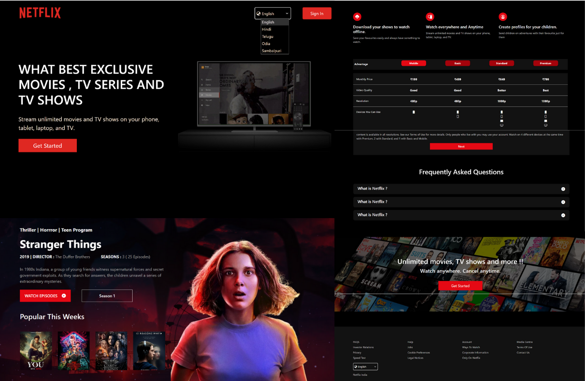

# Netflix Clone (React.js Template)

This is a **Netflix Clone template** built using **React.js**.  
It features a modern UI with a home page layout similar to Netflix, including movie thumbnails and category sections.  
The design is responsive and mobile-friendly, using components like rows, banners, and navigation bars.  
No backend or streaming functionality is included — it's just a front-end template.  
Perfect for learning React basics, component structure, and styled layouts.

    
   [Visit side](https://nneetflixx.netlify.app/) 
